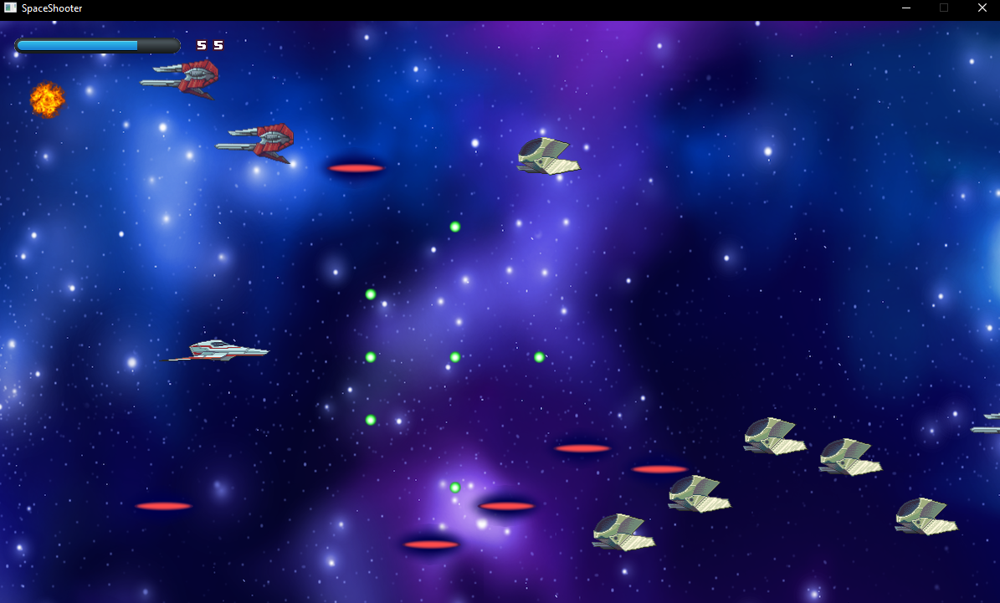

# Academy-Projects
Videogames prototypes done during my academic years using C# as programming language and Aiv_Draw and Aiv_Fast2D as libraries. 

<h2>1.Memory</h2>  

  
"Memory" is a memory game simulation where you can choose the number of cards selecting the amount of rows and columns. 
<b>Library:</b> Aiv_Draw. 
<b>Commands:</b> Click -> LeftMouse button. 

<h2>2.SquareInvaders</h2>  

  
"SquareInvaders" is a demo based on the arcade shooter "SpaceInvaders". 
<b>Library:</b> Aiv_Draw. 
<b>Commands:</b> Shoot -> SpaceBar button | Left -> LeftArrow button | Right -> RightArrow button. 

<h2>3.Lander</h2>  

  
"Lander" is a game where you you have to land your shuttle without destroying it. 
<b>Library:</b> Aiv_Fast2D. 
<b>Commands:</b> Boost -> UpArrow button | LeftRotation -> LeftArrow button | RightRotation -> RightArrow button. 

<h2>4.SpaceShooter</h2>  

  
"SpaceShooter" is an arcade space shooter game. 
<b>Library:</b> Aiv_Fast2D. 
<b>Commands:</b> Shoot/Skip scene -> SpaceBar button | Left -> A button | Right -> D button | Up -> W button | Down -> S button. 

<h2>5.Smoker</h2>  

  
"Smoker" is a survival game where you fight infinite enemies hordes. 
<b>Library:</b> Aiv_Fast2D. 
<b>Commands:</b> Shoot -> LeftMouse button | Jump -> W button | Left -> A button | Right -> D button. 

<h2>6.Boids</h2>  

  
"Boids" is a simulation subject to birds storm behaviour during the flight. 
<b>Library:</b> Aiv_Fast2D. 
<b>Commands:</b> Click -> LeftMouse button. 
